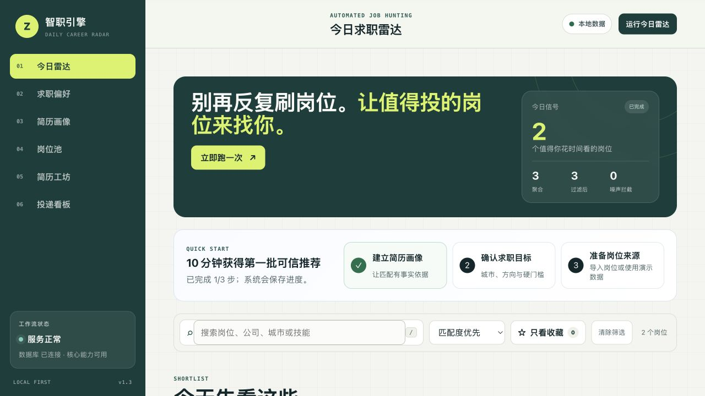
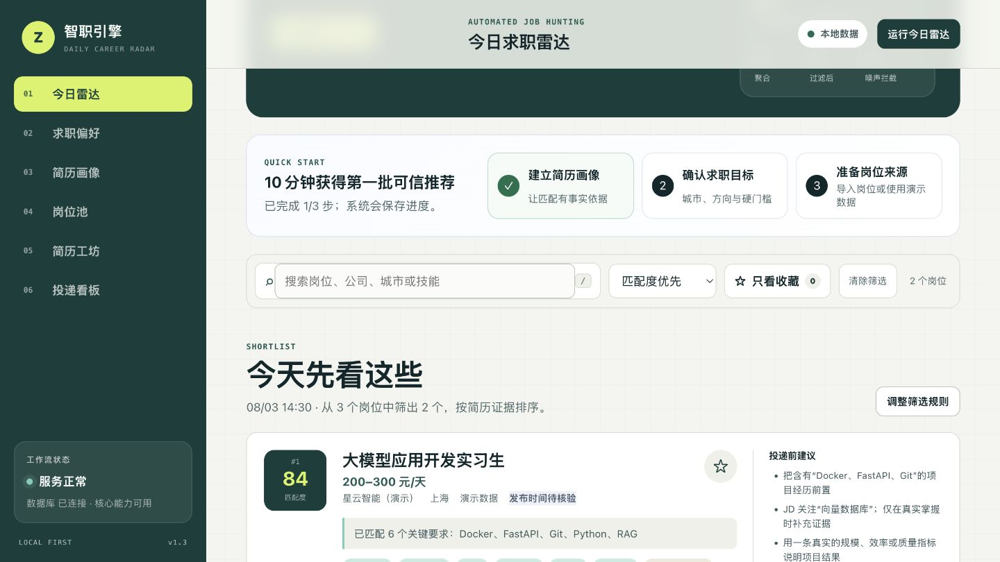
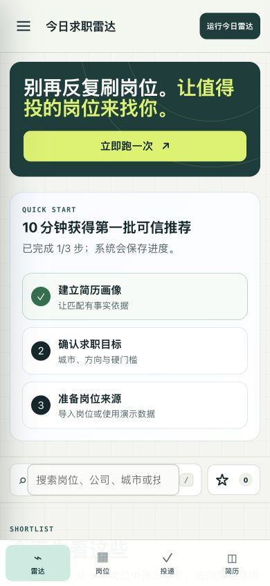
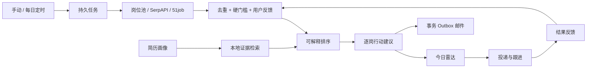

# Career Radar｜AI 大学生求职雷达与投递跟进 Agent

> 给大学生和应届生使用的本地优先 AI 求职工作台：每天聚合并过滤岗位，用简历真实证据解释匹配，再把收藏、投递、跟进和面试沉淀成一条可持续工作流。

[](https://github.com/eatdrop/career-radar/actions/workflows/ci.yml)
[](https://github.com/eatdrop/career-radar/releases/latest)
[](pyproject.toml)
[](LICENSE)
[](#隐私与部署边界)

[快速开始](#3-分钟快速开始) · [查看真实界面](#真实运行界面) · [为什么不是普通-llm-wrapper](#为什么不是普通-llm-wrapper) · [常见问题](#常见问题) · [公开路线图](#公开路线图)



> 截图来自当前版本的真实浏览器运行结果，使用合成简历和带“演示”标识的岗位；不是概念设计图。

## 3 秒看懂

| 你提供 | 系统每天完成 | 你最终得到 |
|---|---|---|
| 一份简历画像和求职偏好 | 聚合岗位 → 过滤噪声 → 检索简历证据 → 可解释排序 | 更少但更值得看的岗位、逐岗简历动作和今日待办 |

大学生求职最耗时的通常不是“不会写简历”，而是：

- 每天在多个平台重复搜索；
- 从社招、资深、外包、重复和过期岗位中找校招机会；
- 逐条阅读 JD，再回头确认自己的哪段经历能证明匹配；
- 针对不同岗位反复改简历；
- 投递后忘记记录、跟进或准备面试。

Career Radar 把这些分散操作收敛成一条可以每天运行、可以失败恢复、可以持续校准的求职工作流。

## 真实运行界面

<p align="center">
  
  
</p>

- 桌面端直接展示岗位匹配分、命中关键词、待核能力和投递前动作；
- 移动端保留雷达、岗位、投递和简历四个高频入口；
- 演示岗位始终标注“演示数据”，发布时间未知时明确要求投递前核验；
- 收藏、不感兴趣、岗位失效和已投递反馈会持久化，避免第二天重复清理。

## 30 秒建立信任

这里不展示未经验证的“效率提升 300%”。当前可以被代码、测试和公开 Release 复核的证据是：

| 证据 | 当前状态 |
|---|---|
| 完整产品闭环 | 简历画像 → 岗位聚合 → 规则过滤 → 证据排序 → 反馈 → 投递 → 跟进 |
| 自动化回归 | 88 项 pytest 测试 |
| 跨平台门禁 | Ubuntu / Windows，Python 3.11 / 3.12 |
| 发行验证 | wheel、源码包、冷安装、`pip check`、`/readyz` |
| 容器验证 | 多阶段构建、非 root 运行、健康检查 |
| 后台可靠性 | 幂等任务、租约心跳、崩溃接管、旧 Worker fencing |
| 邮件可靠性 | 事务 Outbox、稳定 Message-ID、未知送达隔离 |
| 数据演进 | SQLite schema v4，可从旧数据库事务内无损升级 |
| 隐私默认值 | 本机监听、原始简历默认不落库、联系方式脱敏、AI 按次授权 |

正式版本与产物：[`v1.3.0`](https://github.com/eatdrop/career-radar/releases/tag/v1.3.0)。

## 3 分钟快速开始

### 1. 准备环境

- Python 3.11 或 3.12；
- Git；
- Chrome 只在使用 51job 可选采集时需要。

检查 Python：

```bash
python3 --version
```

Windows 可以使用：

```powershell
py -3.12 --version
```

### 2. 下载并启动

macOS / Linux：

```bash
git clone https://github.com/eatdrop/career-radar.git
cd career-radar
python3 -m venv .venv
source .venv/bin/activate
python -m pip install -e .
python web_server.py
```

Windows PowerShell：

```powershell
git clone https://github.com/eatdrop/career-radar.git
cd career-radar
py -3.12 -m venv .venv
.\.venv\Scripts\python.exe -m pip install -e .
.\.venv\Scripts\python.exe web_server.py
```

核心演示流程不要求 API Key，也不需要先安装前端依赖。

### 3. 打开并完成首次验收

浏览器访问：

```text
http://127.0.0.1:3000
```

然后按照页面完成：

1. 粘贴一份合成简历，建立简历画像；
2. 返回“今日雷达”，勾选“用演示数据验收”；
3. 点击“立即跑一次”；
4. 查看匹配证据和投递建议；
5. 收藏、忽略或将岗位记入投递看板；
6. 设置下一步行动、跟进或面试时间。

正常情况下，不配置任何外部服务也可以跑通这条闭环。

## 它解决的是刚需吗

### 是真实问题，但目标人群不是“所有人”

Career Radar 针对的是高频求职期的大学生、应届生和初级岗位候选人。对只偶尔查看一个岗位的人，它可能过重；对每天跨平台筛选、修改和跟进的人，重复劳动和决策疲劳是真实且持续的成本。

项目选择收窄用户，而不是用“所有求职者都需要”夸大市场。

### 抓住 AI Agent 趋势，但不把模型当产品

项目里的 Agent 不是聊天框包装，而是：

- 有明确目标：每天找出值得投入时间的岗位；
- 有工具：岗位源、规则过滤、简历证据检索、可选模型、邮件和投递 CRM；
- 有状态：简历、偏好、任务、反馈、投递和提醒都持久化；
- 有反馈：收藏、忽略、失效和投递影响后续结果；
- 有边界：外部能力显式降级，AI 不能无证据新增经历。

### 当前仍需真实用户证明的部分

项目已经证明“可以稳定运行和发布”，但尚未公开声称“提高了多少面试率”。v1.4 会优先通过 3–5 名真实用户至少 7 天的试用，验证：

- 无效岗位阅读量是否下降；
- 重复噪声率是否下降；
- 每个有效投递所需时间是否减少；
- 跟进完成率和面试转化是否改善。

没有样本时不虚构增长数据，这是降低 AI 生成感的重要原则。

## 为什么不是普通 LLM Wrapper

| 常见一次性 AI 求职工具 | Career Radar |
|---|---|
| 输入 JD，生成一段文本 | 每日持续聚合、过滤、匹配和跟踪 |
| 只给出“适合/不适合” | 展示命中关键词、缺口和简历证据 |
| 每次请求没有历史 | SQLite 保存偏好、反馈、任务、投递和提醒 |
| 模型失败后流程中断 | 无 Key 时本地核心仍可运行，失败显式降级 |
| 生成内容容易补充不存在的经历 | AI 按次授权，并受简历证据约束 |
| 内存线程或同步请求 | 持久任务、幂等、lease、重试和崩溃恢复 |
| 发邮件失败就直接重发 | Outbox 区分可重试失败与未知送达 |

独特价值不在于“接入了大模型”，而在于把模型放进一个受证据、授权、故障语义和用户反馈约束的业务流程。

## 核心功能

### 岗位发现与降噪

- 本地岗位池、SerpAPI、51job 可选采集和显式演示数据；
- 稳定 `job_key`、岗位来源、发布时间、截止时间和新鲜度；
- 排除词、Senior/Lead/Manager 和三年以上经验门槛；
- 搜索、排序、收藏、只看收藏和跨运行反馈过滤。

### 简历证据匹配

- TXT、DOCX、PDF 或粘贴文本；
- 技能、教育、经历、项目和量化成果解析；
- 本地证据分块与检索；
- 匹配关键词、缺失关键词、引用证据和逐岗修改动作；
- 可选 DeepSeek 增强，默认不调用外部 AI。

### 投递与行动闭环

- submitted、viewed、interviewing、offered、rejected 状态；
- 简历版本、岗位链接、备注和下一步行动；
- 跟进时间、面试时间、7 日待办和逾期提示；
- 回复率、面试率和状态时间线数据基础；
- 可选每日邮件摘要。

## 工作原理



匹配分是用于排序的可解释启发式，不是招聘方 ATS 分数，也不是录用概率。

## 接入真实能力

复制配置模板：

```bash
cp .env.example .env
```

按需安装：

```bash
python3 -m venv .venv
source .venv/bin/activate
pip install -e '.[dev]'
```

| 能力 | 安装/配置 | 说明 |
|---|---|---|
| Google Jobs 聚合 | `SERPAPI_KEY` | 通过 SerpAPI 获取公开岗位 |
| DeepSeek 增强 | `pip install -e '.[ai]'` + `DEEPSEEK_API_KEY` | 只有用户本次明确授权才调用 |
| PDF 简历 | `pip install -e '.[files]'` | TXT/DOCX 不需要额外依赖 |
| 51job 采集 | `pip install -e '.[crawler]'` | 依赖 Chrome，可能受站点验证影响 |
| MCP | `pip install -e '.[mcp]'` | allowlist 适配层，不是 Web 前置条件 |
| 邮件摘要 | 配置 `SMTP_*` | 密码仅从服务端环境变量读取 |

请遵守岗位来源的服务条款、robots 规则和合理频率。生产用途优先使用正式 API 或授权数据源，不要绕过验证码或访问控制。

## Docker

```bash
cp .env.example .env
docker build -t career-radar .
docker run --rm -p 127.0.0.1:3000:3000 \
  -v career-radar-data:/data \
  --env-file .env \
  career-radar
```

示例只将端口发布到宿主机回环地址。

## 常见问题

<details>
<summary><strong>没有 API Key，可以使用吗？</strong></summary>

可以。简历画像、本地证据检索、规则匹配、演示雷达和投递看板都能离线运行。SerpAPI、DeepSeek、SMTP 和 51job 是可选增强。
</details>

<details>
<summary><strong>启动后浏览器打不开怎么办？</strong></summary>

先确认终端没有报错，并访问 `http://127.0.0.1:3000`，不要使用 `0.0.0.0`。如果 3000 端口被占用：

```bash
python3 web_server.py --port 3001
```

然后访问 `http://127.0.0.1:3001`。
</details>

<details>
<summary><strong>提示 python3 或 py 不存在怎么办？</strong></summary>

安装 Python 3.11 或 3.12，并在安装 Windows Python 时勾选 “Add Python to PATH”。重新打开终端后执行 `python3 --version` 或 `py -3.12 --version`。
</details>

<details>
<summary><strong>PDF 简历为什么解析失败？</strong></summary>

安装文件处理依赖：

```bash
pip install -e '.[files]'
```

扫描版 PDF 可能没有文本层，当前版本不内置 OCR；可以先导出为可复制文本的 PDF、DOCX 或 TXT。
</details>

<details>
<summary><strong>51job 没有采集到岗位，是程序坏了吗？</strong></summary>

不一定。页面结构、登录验证、验证码和地区网络都可能影响 Selenium 采集。系统会明确返回失败，不会伪造真实岗位。优先使用本地岗位池或正式招聘 API。
</details>

<details>
<summary><strong>演示岗位是真实岗位吗？</strong></summary>

不是。演示岗位只用于验证完整流程，界面始终显示“演示数据”，不能作为真实投递依据。
</details>

<details>
<summary><strong>简历会上传给大模型吗？</strong></summary>

默认不会。`STORE_RAW_RESUME=false` 时原文不持久化，证据块先脱敏并保存在本机。即使配置了 AI Key，也只有用户在本次优化中明确授权才会发送相关内容。
</details>

<details>
<summary><strong>数据保存在哪里，怎样备份？</strong></summary>

默认保存在系统用户数据目录下的 `jobsearch-ai-assistant/job_tracker.db`。也可以通过 `APP_DATA_DIR` 指定目录。升级前停止服务并备份整个数据目录，详细步骤见[跨账号续接与运维报告](docs/CODEX_CONTINUATION_GUIDE.md#23-备份恢复与回滚)。
</details>

<details>
<summary><strong>可以直接部署到公网吗？</strong></summary>

不可以直接暴露。当前版本没有账号、MFA、多租户或 RBAC。远程访问必须放在启用 TLS、身份认证和访问审计的网关之后，并配置精确的 `ALLOWED_HOSTS`。
</details>

<details>
<summary><strong>这是自动投递工具吗？</strong></summary>

不是。系统帮助发现、判断、改写和跟进，但不会替用户登录招聘平台、绕过限制或批量代投。最终内容和操作都由用户确认。
</details>

## 隐私与部署边界

- 当前定位：可信设备上的单用户本地优先 Beta；
- 默认监听 `127.0.0.1`，CORS 关闭并严格校验 Host；
- 不保存 SMTP 密码或 AI Key 到数据库；
- 默认不持久化原始简历，并脱敏常见联系方式；
- API 不包含登录、多租户或企业权限；
- SQLite 目标是单节点，不支持真正多节点水平扩展；
- 企业化需要认证、租户隔离、PostgreSQL/独立队列、审计、备份和事件响应。

漏洞请按 [`SECURITY.md`](SECURITY.md) 私密报告，不要在公开 Issue 中上传真实简历、数据库、API Key 或利用细节。

## 开发与验证

```bash
python3 -m venv .venv
source .venv/bin/activate
pip install -e '.[dev]'
ruff check src tests web_server.py
ruff format --check src tests web_server.py
pytest
```

正式发布还需执行 wheel 冷安装、Docker 冒烟、真实浏览器验收、备份恢复和 [Release checklist](.github/RELEASE_CHECKLIST.md)。

## 公开路线图

### v1.4：个性化求职行动 Agent

- 本地求职漏斗和推荐批次评测；
- 由收藏、忽略、投递和结果驱动的可解释个性化排序；
- 一岗一策：证据映射、改写草稿、求职信、面试准备和跟进草稿；
- 今日行动中心和投递时间线；
- 岗位可信度、主动有效性核验和跨来源去重；
- Playwright 主流程和自动化无障碍检查；
- 3–5 名真实用户至少 7 天的试用复盘。

路线图不等于已经交付。完整 Definition of Done 和 v1.5/v2.0 条件路线见[跨 Codex 账号续接报告](docs/CODEX_CONTINUATION_GUIDE.md#17-v14-建议范围个性化求职行动-agent)。

## 文档导航

- [公开项目报告](docs/PUBLIC_PROJECT_REPORT.md)：面向用户、面试官、评审和合作方；
- [跨 Codex 账号续接报告](docs/CODEX_CONTINUATION_GUIDE.md)：完整架构、边界、风险、规划、发布和回滚手册；
- [技术架构](plans/architecture.md)：业务流、运行架构和持久化；
- [版本记录](CHANGELOG.md)：正式版本已交付能力；
- [安全策略](SECURITY.md)：安全边界和漏洞报告；
- [发布检查表](.github/RELEASE_CHECKLIST.md)：公开发布人工门禁。

## 参与项目

欢迎提交可复现 Bug、脱敏后的岗位解析失败样本、校招过滤规则、移动端/无障碍问题和能直接改善求职结果的产品建议。

如果这个项目确实减少了你的重复筛岗或跟进遗漏，欢迎 Star，并在 Issue 中分享不含个人信息的使用反馈。真实失败样本比“很好用”更能帮助项目迭代。

## License

[MIT](LICENSE)
