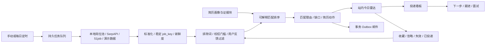
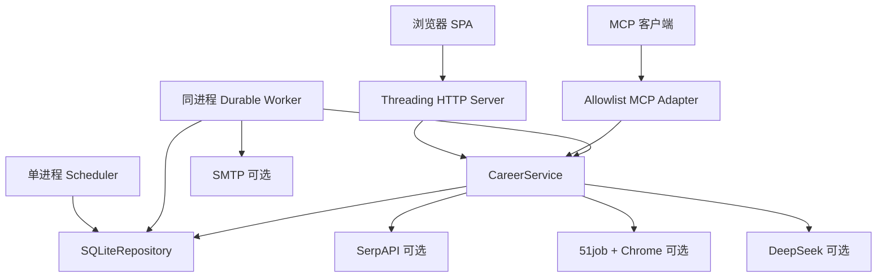

# 智职引擎跨账号续接报告

> 用途：让一个没有历史对话、只拿到 GitHub 仓库的新 Codex 账号或新维护者，可以在不猜测、不重做和不破坏既有边界的前提下继续迭代。

- 最后审计日期：2026-08-03
- 产品基线：`v1.3.0`
- 数据库基线：schema v4
- 公开仓库：<https://github.com/eatdrop/career-radar>
- 正式版本：<https://github.com/eatdrop/career-radar/releases/tag/v1.3.0>

## 1. 先读结论

智职引擎目前是一个经过发布验证的、面向可信设备单用户的本地优先求职工作台。它已经不是一次性 Demo：核心闭环、持久任务、失败恢复、邮件 Outbox、数据库迁移、隐私默认值、跨平台 CI、发行包和 Docker 验证均已落地。

它也还不是可直接面向企业或公众开放注册的 SaaS。当前没有账号体系、租户隔离、RBAC、云端密钥托管、分布式数据库或多节点 Worker。任何后续维护者都必须保持这项表述，不能把“具备工业级工程细节”误写成“已经具备完整企业 SaaS 能力”。

下一阶段建议版本是 `v1.4`，主题不是继续堆页面，而是把“岗位推荐工具”升级为“个性化求职行动 Agent”：让用户反馈真正改变后续排序，让每个岗位形成可执行动作包，并用真实漏斗指标验证是否提高求职效率。

## 2. 信息可信度与更新纪律

本报告按以下优先级判断事实：

1. 当前代码、数据库迁移和自动化测试；
2. `README.md`、`SECURITY.md`、`CHANGELOG.md` 与发布检查表；
3. 本报告中的路线图；
4. 历史对话或口头设想。

发生冲突时以前两项为准。每次正式版本发布时应同步更新：

- 版本、schema、测试数量和正式 Release 链接；
- “已实现 / 部分实现 / 未实现”能力矩阵；
- 已知限制和安全边界；
- 下一版本验收标准；
- GitHub 中仍打开的依赖或产品 PR。

禁止把规划项写成已上线能力，也禁止为了展示效果伪造外部岗位、AI 调用成功、投递结果或用户指标。

## 3. 产品定义

### 3.1 一句话定位

面向大学生和应届生的本地优先每日求职雷达：自动聚合与过滤岗位，用简历真实证据解释匹配，生成逐岗行动建议，并持续跟踪投递、跟进和面试。

### 3.2 目标用户

- 同时关注多个招聘渠道、每天重复筛选岗位的大学生和应届生；
- 需要明确排除 Senior、Lead、外包和高年限岗位的初级求职者；
- 希望保留简历隐私、优先本地处理数据的个人用户；
- 需要展示 Agent、产品设计、后端工程、可靠性和前端闭环能力的项目维护者。

### 3.3 当前不适合的用户

- 需要多人协作、组织权限和审计控制的企业招聘团队；
- 需要系统自动代替本人登录招聘平台、批量投递或绕过平台限制的用户；
- 需要法律、签证、薪酬或录用概率保证的用户；
- 需要跨区域高可用、多节点水平扩展或严格合规认证的生产组织。

### 3.4 核心痛点

1. 岗位信息过载，社招、资深、外包、重复和过期岗位混杂；
2. 用户无法快速判断“这个岗位为什么适合我”；
3. 简历修改建议往往脱离真实经历，容易产生编造风险；
4. 收藏、投递、跟进和面试上下文散落在多个平台；
5. 单次生成工具没有长期反馈，第二天仍然重复推荐同样的噪声。

### 3.5 产品原则

- 先用确定性规则降噪，再让 AI 处理判断和表达；
- 匹配必须引用真实简历证据，模型不得新增事实；
- 外部能力是可选增强，失败时必须显式降级；
- 默认本地、最小持久化、单次 AI 授权；
- 推荐必须能转化为下一步行动，并最终由结果指标验证；
- 自动化不能越过用户授权代投、骚扰招聘方或违反数据源条款。

## 4. 当前完整工作流



首次使用的推荐顺序是：

1. 建立简历画像；
2. 设置岗位关键词、城市、来源、排除规则和推荐数量；
3. 导入真实岗位或显式启用演示数据；
4. 创建一次异步雷达任务；
5. 搜索、排序、收藏、忽略或标记岗位失效；
6. 将合适岗位加入投递看板；
7. 设置简历版本、下一步动作、跟进或面试时间；
8. 在后续雷达中复用反馈，减少重复噪声。

## 5. 已实现能力矩阵

| 领域 | 状态 | 当前实现 | 重要说明 |
|---|---|---|---|
| 简历输入 | 已实现 | TXT、DOCX、PDF、粘贴文本 | PDF 需要 `files` 可选依赖 |
| 简历画像 | 已实现 | 基础信息、技能、教育、经历、项目、量化结果 | 规则解析，不是通用简历理解模型 |
| 本地 RAG | 已实现 | 简历分块、关键词检索、证据引用 | 当前是词项重叠检索，不是向量数据库 |
| 岗位来源 | 部分实现 | 本地岗位池、SerpAPI、51job、演示数据 | 51job Selenium 易受页面和验证变化影响 |
| 岗位过滤 | 已实现 | 排除词、资深词、三年以上经验门槛 | 规则可能误判，需要反馈与测试持续校准 |
| 岗位排序 | 已实现 | 技能覆盖、标题命中、经历证据加权 | 静态启发式，不会从结果自动学习 |
| 岗位新鲜度 | 部分实现 | 发布时间、截止时间、fresh/aging/expired/unknown | 依赖来源字段，尚未主动复查链接有效性 |
| 用户反馈 | 已实现 | saved/dismissed/expired/applied 持久化 | 目前用于过滤和展示，未训练个性化排序 |
| 投递 CRM | 已实现 | 状态、备注、简历版本、来源链接、下一步动作 | 单用户看板 |
| 提醒 | 部分实现 | 7 日待办和逾期展示 | 尚无系统通知、日历或独立提醒 Worker |
| 投递时间线 | 部分实现 | 数据表记录创建和状态变化 | 尚未作为完整 API/前端时间线开放 |
| 邮件摘要 | 已实现 | SMTP、事务 Outbox、重试、未知送达隔离 | 外部 SMTP 需要发布环境人工验收 |
| 异步任务 | 已实现 | 幂等、租约、心跳、重试、崩溃接管、fencing | Worker 与 Web 同进程，未提供独立进程模式 |
| 调度 | 已实现 | 按时区和自然日幂等创建任务 | 内置调度器适合单进程 |
| REST API | 已实现 | `/api/v1` 统一响应、状态码、请求 ID | 无用户认证 |
| MCP | 已实现 | allowlist 适配层 | 可选能力，不是 Web 前置条件 |
| 前端 | 已实现 | 原生 HTML/CSS/JS 响应式 SPA | 无框架构建链，自动化 E2E 尚未进入 CI |
| Docker | 已实现 | 多阶段构建、非 root、健康检查 | 示例默认只暴露到宿主机回环地址 |
| 发布工程 | 已实现 | wheel、sdist、GitHub Release、跨平台 CI | 仍需维护者完成人工发布检查表 |
| 多用户 SaaS | 未实现 | 无账号、租户、RBAC、密码重置 | 禁止直接公网暴露现有端口 |
| 企业能力 | 未实现 | 无 SSO、组织审计、合规导出、SLA | 只能作为未来条件规划 |

## 6. 技术栈与依赖策略

### 6.1 核心栈

- Python 3.11 / 3.12；
- 标准库 `ThreadingHTTPServer` 提供 Web 与 REST；
- SQLite WAL、外键、`busy_timeout` 与短连接模型；
- 原生 HTML、CSS、JavaScript 前端；
- `pytest`、Ruff、GitHub Actions；
- setuptools 构建 wheel 与源码包；
- Docker 非 root 容器。

### 6.2 可选依赖

- `openai`：调用 DeepSeek 的 OpenAI 兼容 API；
- `mcp`：MCP allowlist 适配；
- `selenium`、`webdriver-manager`：51job 可选采集；
- `pymupdf`：PDF 简历解析。

核心业务刻意不依赖大型 Web 框架，优点是安装轻、边界清晰；代价是路由、中间件、认证、OpenAPI 和可观测性需要自行实现。若未来进入多人云部署，应基于真实压力和团队能力决定是否迁移到成熟 ASGI 栈，不应只为“看起来工业级”重写。

## 7. 仓库地图

| 路径 | 职责 | 修改时注意 |
|---|---|---|
| `src/jobsearch_mcp_server/config.py` | 环境配置和安全默认值 | 新配置必须进入 `.env.example` 并有边界校验 |
| `repository.py` | schema、迁移、队列、Outbox、简历、反馈、投递 | 只能追加迁移，不得修改已发布迁移的语义 |
| `services.py` | 业务规则、解析、匹配、外部集成 | REST 与 MCP 共用，避免在路由层复制业务 |
| `webapp.py` | HTTP、路由、安全头、限流、静态资源 | Host 校验必须先于 API 与静态资源处理 |
| `worker.py` | 持久任务与 Outbox Worker | 保持 claim token、lease 和 fencing 不变量 |
| `scheduler.py` | 单进程每日调度 | 多副本场景不能直接复用内置调度 |
| `ops.py` | 本地可信运维命令 | 操作必须显式、可审计，不增加模糊批量重试 |
| `server.py` | MCP allowlist | 不得开放任意工具调用或服务端路径读取 |
| `crawler/` | 51job 可选采集 | 遵守平台条款，解析失败必须显式 |
| `web/` | 响应式工作台 | 维持键盘、移动端和减少动画模式 |
| `tests/` | 88 项回归测试 | 修改关键不变量必须先补失败测试 |
| `.github/workflows/ci.yml` | 跨平台质量、发行包、容器门禁 | Actions 必须固定完整 SHA |
| `.github/RELEASE_CHECKLIST.md` | 公开发布人工门禁 | 每次 Release 都要实际执行，不是展示文档 |

## 8. 运行架构与边界



### 8.1 支持的运行方式

- 源码快速启动：`python3 web_server.py`；
- 安装后启动：`jobsearch-web`；
- Docker 单节点运行；
- 可选 MCP：`jobsearch-mcp-server`；
- 本地运维：`jobsearch-ops`。

### 8.2 当前明确不支持

- 把 `BACKGROUND_WORKERS_ENABLED=false` 当成独立 Worker 模式；
- 多个内置 Scheduler 同时面向同一业务运行；
- SQLite 上的真正多节点横向扩展；
- 未经网关保护直接监听公网；
- 浏览器直接接触 SMTP、SerpAPI 或 AI 密钥；
- 接受任意服务器文件路径作为简历输入。

## 9. 数据模型与迁移不变量

当前 schema v4 包含：

| 表 | 作用 | 敏感性/保留策略 |
|---|---|---|
| `schema_meta` | 已应用迁移版本 | 必须单调递增 |
| `applications` | 投递记录、提醒、简历版本和来源 | 个人求职数据 |
| `application_events` | 投递创建与状态变化时间线 | 个人行为数据 |
| `resumes` | 简历画像、评分、可选原文 | 默认不保存原文 |
| `resume_evidence` | 本地匹配证据块 | 始终先脱敏 |
| `app_state` | 偏好、岗位池、最新摘要 | 可能包含岗位和邮箱地址 |
| `radar_runs` | 雷达运行审计与结果 | 用于故障对账 |
| `operation_jobs` | 持久异步任务 | 不向公共 API 暴露内部 payload/claim token |
| `outbox_messages` | 最小邮件意图和送达状态 | 不保存 SMTP 密码 |
| `job_feedback` | 收藏、忽略、失效、已投递 | 含最小岗位快照 |

迁移规则：

1. 只能新增 `_migrate_v5`、`_migrate_v6` 等新迁移；
2. 每次迁移在 `BEGIN IMMEDIATE` 事务内执行；
3. 发现数据库版本高于程序支持版本时必须拒绝启动；
4. 升级前先停止服务并备份数据卷；
5. 不允许用“删库重建”代替兼容迁移；
6. 新的用户数据字段要同步考虑脱敏、API 最小返回和删除/导出策略。

## 10. 核心算法说明

### 10.1 简历解析与评分

当前解析依赖正则、关键词表和结构线索，提取姓名、邮箱、电话、求职目标、技能、教育、经历、项目及量化结果。总分由联系信息、技能、项目、经历、教育、可读性和目标明确度组成。

它适合可解释的本地基线，不应被描述为经过大规模简历数据训练的模型。未来调整评分时要防止用户为“刷分”堆关键词，并优先验证是否提高岗位匹配和面试转化。

### 10.2 本地证据检索

简历按段落聚合为约 520 字符的证据块，检索使用规范化词项重叠。优点是离线、透明、无额外基础设施；缺点是同义词、跨语言和语义表达能力有限。

向量或混合检索只有在以下条件满足后才值得引入：

- 有足够真实失败样本证明词项检索不足；
- 能提供离线或用户明确同意的嵌入方案；
- 有固定评测集比较召回率、解释性、延迟和成本；
- 不再出现“Embedding 失败后伪造向量”的历史问题。

### 10.3 岗位过滤

过滤使用用户排除词、Senior/Lead/Principal/Manager 等资深词和三年以上经验门槛。被拒绝岗位保留过滤原因，用于摘要统计。

### 10.4 岗位排序

当前分数上限为 98，核心公式为：

```text
30 基础分
+ 技能/关键词覆盖率 × 40
+ 最多 15 分的简历证据加成
+ 最多 15 分的岗位标题命中加成
```

分数是产品排序启发式，不是录用概率、ATS 官方分数或统计置信度。公众文档和前端都不应暗示其为招聘方评分。

### 10.5 岗位标识与新鲜度

- 优先用安全的 HTTP(S) 岗位链接生成 SHA-256 截断 `job_key`；
- 无链接时使用公司、岗位、地点和来源组合；
- 7 天内发布为 `fresh`，更早为 `aging`；
- 截止时间已过为 `expired`；
- 无可靠字段为 `unknown`。

当前没有主动访问岗位链接验证有效性，`last_verified_at` 也不是完整的周期性核验系统。

## 11. API 和异步契约

REST 使用 `/api/v1`，统一返回：

```json
{
  "success": true,
  "data": {},
  "meta": {
    "request_id": "...",
    "timestamp": "..."
  }
}
```

关键不变量：

- 异步雷达创建必须携带 8–128 位 `Idempotency-Key`；
- 同一个 Key 重试必须复用参数，不同参数返回 `409`；
- 创建返回 `202`、`Location` 与 `Retry-After`；
- 任务查询不暴露内部 payload、幂等键、worker_id 或 claim token；
- 所有写接口严格验证布尔值、列表、长度、状态和 URL；
- 业务错误用稳定 code，不把异常堆栈返回给前端；
- MCP 只调用相同的 `CareerService`，不复制业务规则。

完整 API 摘要见 `README.md`。增加 API 时必须同时补：服务测试、HTTP 契约测试、错误路径、权限/隐私判断和文档。

## 12. 可靠性设计

### 12.1 持久任务

- 原子 claim；
- 随机 claim token；
- 可续租 lease 和 heartbeat；
- 旧 Worker fencing；
- 指数退避；
- 明确永久错误；
- 锁竞争不消耗重试预算；
- 业务完成但队列完成写失败时，提供一次有界对账。

### 12.2 邮件 Outbox

- 雷达结果和邮件意图原子提交；
- 幂等键和稳定 Message-ID；
- 发送前失败可重试；
- SMTP 已提交但连接异常时标记 `delivery_unknown`；
- 未经人工核对不得盲目重发；
- `jobsearch-ops` 提供确认送达或一次受控重试。

这些机制是项目最有价值的工业级工程资产之一。重构 Worker 或数据库时必须保留现有故障语义，而不是只保留“有队列”这一表象。

## 13. 安全与隐私边界

已实现：

- 默认仅监听 `127.0.0.1`；
- 严格 `Host` allowlist，拒绝重复 Host；
- CORS 默认关闭；
- CSP、点击劫持、MIME 嗅探和权限策略安全头；
- 请求体大小限制、进程内限流和并发上限；
- 数据目录和数据库尽力设置为仅用户可读；
- `.env`、数据库、简历、日志和调试文件默认忽略；
- 原始简历默认不持久化；
- 邮箱、电话、微信/QQ 和公开账号递归脱敏；
- 外部 AI 需要本次请求明确授权；
- 外部 URL 只接受无凭据的 HTTP(S)。

尚未实现：

- 用户认证、MFA、密码与会话管理；
- 多租户行级隔离和 RBAC；
- 云端 KMS/Secrets Manager 集成；
- 完整访问审计、数据主体导出/删除流程；
- SAST、DAST、SBOM、签名制品和正式合规认证；
- 公网 WAF、DDoS 防护和组织级事件响应。

因此现版本只能称为“本地优先、安全默认的 Beta”，不能称为已经满足企业合规。

## 14. 前端现状

已经具备：

- 三步首次使用引导；
- 岗位优先的信息层级；
- 搜索、排序、收藏和只看收藏；
- 收藏/忽略/失效/投递反馈；
- 新鲜度状态与未知信息提醒；
- 投递弹窗、下一步动作和时间提醒；
- 7 日待办、逾期、回复率和面试率；
- 移动端底部导航、触控尺寸、键盘焦点和减少动画模式。

仍需补齐：

- Playwright 等真实浏览器 E2E 进入 CI；
- 自动化无障碍检查和屏幕阅读器验收；
- 更稳定的加载骨架、失败恢复和空状态一致性；
- “今日行动”首页，而不是只展示数据看板；
- 投递时间线可视化；
- 日历、系统通知或邮件提醒；
- 用户行为事件与漏斗分析；
- 对真实岗位数据量和移动端长列表的性能测试。

## 15. 测试、CI 与发布基线

当前自动化测试共 88 项，覆盖：

- 离线核心闭环和校招过滤；
- 简历证据与隐私脱敏；
- 岗位反馈与投递提醒；
- schema v1–v4 升级和未来版本拒绝；
- HTTP 状态码、统一错误和 Host 防护；
- 幂等异步 API；
- 队列并发 claim、重试、lease、崩溃恢复和 fencing；
- Outbox 重试、未知送达隔离与人工处置；
- 前端关键元素契约。

GitHub Actions 门禁：

- Ubuntu / Windows；
- Python 3.11 / 3.12；
- Ruff lint 与 format；
- JavaScript 语法检查；
- pytest；
- 构建 wheel/sdist；
- 全新虚拟环境安装最终 wheel、`pip check`、`/readyz`；
- Docker 非 root 构建与就绪冒烟。

缺口：

- 没有覆盖真实 SerpAPI、DeepSeek、SMTP 和 Chrome 的 CI 凭据环境；
- 没有浏览器 E2E CI；
- 没有覆盖率硬门槛、性能基线和长时间稳定性测试；
- 没有从 GitHub Release 重新下载资产后的自动验收；
- 没有制品签名、provenance 或 SBOM。

## 16. 已知风险矩阵

| 风险 | 概率 | 影响 | 当前控制 | 后续动作 |
|---|---|---|---|---|
| 51job 页面变化或风控 | 高 | 中 | 可选依赖、失败显式 | 优先正式 API/授权源，适配器契约测试 |
| 岗位发布时间缺失或失真 | 高 | 中 | `unknown` 标签 | v1.4 增加来源可信度和主动核验 |
| 静态评分误导用户 | 中 | 高 | 可解释关键词和缺口 | 明确非录用概率，引入反馈校准和离线评测 |
| AI 编造简历事实 | 中 | 高 | 单次授权、证据约束、本地降级 | 增加逐条事实引用和用户确认门禁 |
| SQLite 多节点误用 | 中 | 高 | 文档边界、单节点默认 | 云化前迁移受管数据库与独立队列 |
| 直接公网暴露 | 中 | 高 | 回环监听、Host allowlist | 提供受支持的认证反代部署蓝图 |
| 邮件重复发送 | 低 | 高 | Outbox、Message-ID、unknown 隔离 | 保持人工对账，增加服务商事件对接 |
| 个人数据长期保留 | 中 | 高 | 本地存储、忽略规则 | 增加导出、删除、保留期和备份策略 |
| 前端回归未被发现 | 中 | 中 | 契约测试、人工浏览器验收 | v1.4 引入 Playwright 与可访问性检查 |
| 规划过度工程化 | 高 | 中 | 版本主题和边界 | 先验证真实用户结果，再上多租户/微服务 |

## 17. v1.4 建议范围：个性化求职行动 Agent

### 17.1 版本目标

让系统从“给出一批匹配岗位”升级为“根据用户历史做出更好的下一步建议”，并能用数据回答：是否减少无效阅读、是否提高有效投递和跟进完成率。

### 17.2 P0：先建立产品证据

1. 定义最小事件模型：雷达曝光、岗位查看、收藏、忽略、投递、回复、面试、Offer；
2. 只采集产品必需的本地事件，默认不发送第三方分析平台；
3. 增加本地漏斗：曝光→查看→收藏→投递→回复→面试；
4. 记录推荐批次、排序版本和分数解释，支持离线评测；
5. 邀请 3–5 名真实求职用户连续试用至少 7 天；
6. 收集失败样本，而不是只收满意截图。

### 17.3 P0：个性化排序

第一阶段不需要训练复杂模型，可以增加可解释策略层：

- 用户收藏/投递的岗位关键词和公司类型加权；
- dismiss/expired 降权和硬过滤；
- 控制同公司、同岗位和同来源的重复暴露；
- 新鲜度、来源可信度和资料完整度进入排序；
- 每个加减分原因都在结果中可追溯；
- 保留全局静态基线作为回退，并允许关闭个性化。

验收：固定离线样本集上，Top-N 相关性不低于 v1.3；真实用户重复噪声率下降；排序延迟和本地隐私边界不退化。

### 17.4 P0：一岗一策行动包

对用户选择的单个岗位生成：

- 应前置的真实项目经历；
- JD 要求与简历证据的逐条对应；
- 缺失但需要用户核实的关键词；
- 可选择的项目经历改写草稿；
- 求职信/私信草稿；
- 针对性面试问题和准备清单；
- 跟进邮件草稿；
- 本次使用的简历版本和事实来源。

所有文本生成都必须遵守：默认本地建议；调用 AI 前单次授权；每条新增陈述必须能回指简历证据或由用户确认；不得自动发送或自动投递。

### 17.5 P1：今日行动中心

- 首页优先显示今天应完成的投递、跟进和面试准备；
- 支持完成、延后和重新安排；
- 增加投递时间线；
- 提供可选邮件/浏览器通知，默认关闭；
- 同一动作必须幂等，避免重复提醒和重复邮件。

### 17.6 P1：岗位质量治理

- 来源可信度分层；
- 主动验证链接与截止状态；
- 跨来源规范化去重；
- 疑似外包、培训、虚假高薪和描述异常提示；
- 保留“为什么判定”的解释与用户纠错入口；
- 不将启发式风险提示写成事实指控。

### 17.7 P1：前端与质量

- Playwright 桌面/移动端主流程；
- axe 或等价无障碍检查；
- 长列表、弱网、刷新恢复和并发操作测试；
- 统一加载、错误、重试、空状态和成功反馈；
- 首页从“数据汇总”升级为“行动优先”。

### 17.8 v1.4 Definition of Done

- schema v5 迁移可从 v1–v4 无损升级；
- 事件和排序不保存不必要的原始简历信息；
- 个性化策略可关闭、可解释、可回退；
- 一岗一策没有无证据新增事实；
- 主动提醒不会重复发送；
- 现有 88 项测试全部通过并增加相应回归；
- Playwright 主流程在 CI 通过；
- 使用合成数据完成桌面与移动端浏览器验收；
- 至少完成一轮真实用户试用复盘；
- README、架构、隐私、变更日志和续接报告同步更新；
- wheel、源码包和非 root Docker 继续通过冷安装验收。

### 17.9 v1.4 明确不做

- 自动登录招聘平台或批量代投；
- 绕过验证码、反爬或平台访问控制；
- 多租户 SaaS 和企业 SSO；
- 为了架构展示拆分微服务；
- 未经评测直接上向量数据库或复杂推荐模型；
- 把匹配分包装成录用概率。

## 18. v1.5 与 v2.0 条件路线图

### v1.5：可靠数据与职业资产

只有在 v1.4 的真实用户闭环有效后启动：

- 稳定的岗位来源适配器接口和来源健康度；
- 用户授权的日历/邮件提醒集成；
- 多份简历版本、差异比较、DOCX/PDF 导出；
- 面试准备档案与复盘；
- 数据导出、删除、保留期和自动备份；
- OpenTelemetry/结构化指标、故障面板和发布后合成监控；
- Release 资产重下载验证、SBOM 与制品签名。

### v2.0：托管与企业能力

只有在出现明确的多人需求、付费意愿和运营能力后考虑：

- 账号、组织、租户隔离、RBAC、SSO/MFA；
- PostgreSQL、独立队列和水平扩展 Worker；
- 对象存储、KMS、审计日志和数据生命周期；
- 配额、计费、成本归因、SLO/SLA；
- 管理后台、合规导出、灾备和安全响应；
- 经授权的数据供应商与合同边界。

进入 v2.0 前必须先写 ADR，回答：目标客户是谁、为什么单用户架构不够、迁移成本、数据隔离模型、威胁模型和退出/回滚方案。

## 19. 企业级演进门槛

“企业级”不是增加 Kubernetes 文件。至少要满足：

- 明确租户与数据所有权；
- 认证、授权、审计和最小权限；
- 受支持的备份恢复目标（RPO/RTO）；
- 监控、告警、值班和事件响应；
- 数据保留、导出、删除和合规责任；
- 容量、性能、成本和降级策略；
- 依赖、供应链、漏洞和密钥生命周期；
- 灰度、回滚、迁移兼容和版本支持策略；
- 有真实客户需求证明这些投入的价值。

当前项目已经具备部分可靠性和安全基础，但未达到上述完整门槛。

## 20. 可封装技术栈与 Skill

### 20.1 适合抽成 Python 库的能力

1. `durable-sqlite-worker`：幂等入队、租约心跳、fencing、退避、崩溃接管；
2. `transactional-outbox-lite`：Outbox、稳定 Message-ID、unknown delivery 隔离；
3. `privacy-safe-resume-evidence`：简历分块、联系方式脱敏、证据检索；
4. `job-source-adapter`：统一岗位 schema、稳定 key、新鲜度和来源健康度；
5. `evidence-bound-generation`：证据引用、事实检查和用户确认门禁。

抽库前必须先在本项目中出现至少两个稳定调用方；不要为了“复用”过早制造维护负担。

### 20.2 适合抽成 Codex Skill 的流程

1. `career-radar-release`：版本同步、门禁、构建、冷安装、浏览器验收、Tag/Release；
2. `career-radar-migration`：schema 设计、旧库样本、迁移测试、备份与回滚检查；
3. `job-source-onboarding`：新增岗位源时检查条款、字段映射、失败语义、限流和测试；
4. `privacy-review`：扫描输入、持久化、日志、API、AI 和导出链路；
5. `product-evidence-review`：检查新功能是否关联用户痛点、事件指标和验收样本。

Skill 应保存流程知识、检查清单和脚本；业务逻辑仍应留在代码和测试中，不能只存在于提示词。

## 21. 本地开发操作手册

### 21.1 首次接手

```bash
git clone https://github.com/eatdrop/career-radar.git
cd career-radar
python3 -m venv .venv
source .venv/bin/activate
python -m pip install -e '.[dev]'
```

需要全部可选能力时：

```bash
python -m pip install -e '.[all,dev]'
```

### 21.2 启动

```bash
python3 web_server.py
```

浏览器打开 `http://127.0.0.1:3000`。测试时使用合成简历与演示岗位，不要提交真实简历或密钥。

### 21.3 最小门禁

```bash
ruff check src tests web_server.py
ruff format --check src tests web_server.py
node --check web/assets/app.js
pytest
git diff --check
```

### 21.4 发行级门禁

```bash
python -m build
python -m venv /tmp/career-radar-release-venv
/tmp/career-radar-release-venv/bin/pip install dist/*.whl
/tmp/career-radar-release-venv/bin/pip check
```

同时执行：真实浏览器桌面/移动端验收、非 root Docker 冒烟、数据迁移备份恢复和计划启用的外部服务人工验证。

## 22. 发布流程

1. 从最新 `main` 创建 `agent/<description>`；
2. 检查工作区，不能混入用户无关改动；
3. 同步版本：`pyproject.toml`、`__version__`、前端资产版本、CHANGELOG；
4. 完成自动化和人工门禁；
5. 构建 wheel/sdist 并冷安装；
6. 推送分支并创建草稿 PR；
7. 等待全部 GitHub Actions；
8. 转 ready 并合并；
9. 从合并后的 `main` 创建带注释 Tag；
10. 创建 GitHub Release，附变更、限制、产物和 SHA-256；
11. 从 Release 重新下载并再次安装验证；
12. 核对 `main` 合并后 CI；
13. 更新本报告的基线和下一版本状态。

不要跳过 `.github/RELEASE_CHECKLIST.md`。

## 23. 备份、恢复与回滚

### 23.1 升级前

- 停止服务；
- 备份 `APP_DATA_DIR`；
- 确认 `job_tracker.db` 与 `-wal` / `-shm` 来自同一停机快照；
- 记录当前应用版本和 schema；
- 在副本上先执行迁移与健康检查。

### 23.2 回滚原则

- 代码可以回滚，数据库 schema 不一定能安全降级；
- 程序发现更高 schema 会拒绝启动，这是保护机制；
- 需要回滚数据库时必须恢复升级前完整备份；
- 隐私泄露时先吊销密钥、隔离资产和停止暴露，再处理代码；
- 邮件 `delivery_unknown` 必须先人工核对，不能用重启或批量重试掩盖。

## 24. Codex 跨账号接手步骤

新账号第一轮必须执行只读核对：

```bash
git status -sb
git log --oneline --decorate -8
rg --files --hidden -g '!.git/**'
sed -n '1,260p' docs/CODEX_CONTINUATION_GUIDE.md
sed -n '1,260p' README.md
sed -n '1,220p' SECURITY.md
sed -n '1,220p' .github/RELEASE_CHECKLIST.md
```

然后运行测试，不要先改代码。发现工作区有未提交改动时，默认它们属于用户，不能覆盖、reset 或顺手格式化。

建议给新 Codex 的启动提示词：

```text
你正在接手 https://github.com/eatdrop/career-radar 。
先完整阅读 docs/CODEX_CONTINUATION_GUIDE.md、README.md、SECURITY.md、
.github/RELEASE_CHECKLIST.md，并以当前代码和测试为最高事实来源。
先只读核对 git 状态、当前版本、schema、测试与公开 Issue/PR；不要重做已经发布的 v1.3。
目标是按报告中的 v1.4 Definition of Done 继续迭代。
必须区分已实现、规划中和不支持；保护本地单用户隐私边界、幂等任务、租约 fencing、
事务 Outbox 和单次 AI 授权；不自动代投，不绕过招聘平台限制，不把匹配分称为录用概率。
每次改动先补测试，完成后运行发行级门禁，并通过 PR 发布。
```

## 25. 当前 GitHub 待办

审计时没有开放的产品 Issue，但有 3 个 Dependabot PR：

- PR #2：GitHub Actions 依赖更新；
- PR #3：Docker Python 基础镜像升级到 3.14；
- PR #4：Python 依赖组更新。

处理原则：

- 每个 PR 单独看 diff 和 CI，不批量盲合并；
- Python 3.14 不在当前声明支持矩阵中，PR #3 不能只因 CI 绿就直接合并；
- 升级 Python 运行时前要确认所有可选依赖、wheel、Docker、时区和浏览器依赖兼容；
- Actions 更新继续保持完整 SHA 固定；
- 依赖更新合并后要重新运行发布级门禁。

## 26. 维护者决策规则

遇到新需求时按顺序回答：

1. 它解决哪个真实用户痛点？
2. 成功指标是什么？
3. 是否需要收集新的个人数据？
4. 能否在本地离线完成？
5. 外部失败时如何显式降级？
6. 是否破坏现有数据库和异步不变量？
7. 是否需要用户明确授权？
8. 能否用更小的改动验证假设？
9. 如何自动化测试、人工验收和回滚？
10. README、安全边界和公众表述是否同步？

如果这些问题没有答案，需求不应直接进入实现。

## 27. 最终交接检查表

- [ ] 已阅读本报告和核心仓库文档；
- [ ] 已确认当前 Git 状态，没有覆盖用户改动；
- [ ] 已确认当前版本、schema 和测试基线；
- [ ] 已把需求归类为产品、可靠性、安全、数据源或企业化；
- [ ] 已说明用户痛点、指标和不做事项；
- [ ] 已设计兼容迁移和回滚；
- [ ] 已保护隐私、单次授权和外部降级；
- [ ] 已补自动化测试和真实浏览器验收；
- [ ] 已更新 README、CHANGELOG、架构、公众报告和本报告；
- [ ] 已通过 PR、CI、Tag 和 Release 发布；
- [ ] 未把规划描述为当前能力。

维护这份报告的目的不是让文档越来越长，而是让每个新账号都能快速建立同一套事实、边界和决策标准。
