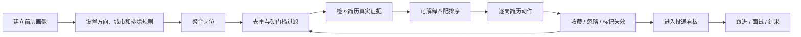
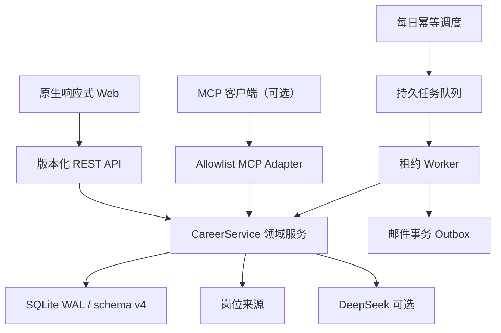

# 智职引擎公开项目报告

> 一个面向大学生和应届生的本地优先每日求职雷达：从岗位发现、证据匹配到投递跟进，把分散的求职操作变成可持续、可解释、可验证的行动闭环。

- 项目名称：智职引擎 · Career Radar
- 当前正式版本：`v1.3.0`
- 项目阶段：公开 Beta
- 开源协议：MIT
- GitHub：<https://github.com/eatdrop/career-radar>
- Release：<https://github.com/eatdrop/career-radar/releases/tag/v1.3.0>

## 1. 三种长度的项目介绍

### 一句话

智职引擎每天聚合和过滤岗位，用简历中的真实证据解释匹配，给出逐岗简历动作，并持续管理投递、跟进和面试。

### 30 秒

大学生求职最浪费时间的不是生成一份简历，而是每天跨平台搜索、排除资深和过期岗位、逐条对照 JD、反复改简历以及投递后忘记跟进。智职引擎把这段流程做成可持续运行的求职雷达：先用确定性规则过滤噪声，再从本地简历证据中解释匹配，最后将合适岗位进入投递看板。它默认本地运行，外部 AI 只有在用户单次授权后才会使用，并且不能编造经历。

### 3 分钟

这是一个兼顾产品、Agent 和工程实现的完整项目。产品上，它从真实求职流程出发，不停留在“输入 JD、输出一段文本”；Agent 上，它组合岗位来源、规则过滤、简历证据检索、可解释排序、可选大模型、用户反馈和行动跟踪；工程上，它实现版本化 REST、SQLite 迁移、持久任务、幂等、租约心跳、崩溃接管、事务 Outbox、隐私脱敏、跨平台 CI、发行包和非 root Docker 验证。

当前版本适合可信设备上的个人使用，而不是直接公网开放注册的企业 SaaS。项目公开说明这一边界，并把认证、多租户、分布式部署和合规能力留到有真实业务证据后再建设。

## 2. 为什么要做

主流招聘平台擅长提供海量岗位，但个人求职者仍然要完成大量重复判断：

- 这个岗位是不是校招或初级岗位？
- 是否混入 Senior、Lead、外包、培训或高年限要求？
- 它和我的哪段项目经历真正相关？
- 应该修改简历的哪一部分，而不是泛泛“优化表达”？
- 我是否已经收藏、忽略或投递过它？
- 什么时候应该跟进，面试前需要准备什么？

智职引擎关注的不是岗位数量，而是把信息转化为更少、更可信、更适合行动的候选列表。

### 2.1 核心价值审视

#### 它解决的是刚需吗

对每天跨平台筛选、针对多个 JD 修改简历并持续跟进的大学生和应届生，这是高频、重复且容易遗漏的真实问题。对只偶尔查看一个岗位的人，完整工作台可能过重。因此项目的合理市场不是“所有求职者”，而是处于集中求职期、需要持续工作流的初级候选人。

项目的价值假设可以被验证：减少无效岗位阅读、减少重复曝光、缩短有效投递准备时间，并提高跟进完成率。当前版本没有虚构这些指标已经提升，v1.4 会通过真实用户试用建立证据。

#### 它抓住了什么趋势

项目抓住的不是“给所有功能加一个 AI 按钮”，而是 AI Agent 从对话走向可执行工作流的趋势：系统具备目标、工具、持久状态、用户反馈、故障恢复和权限边界。模型只是可选的表达增强器，离线核心流程不依赖模型才能成立。

同时，本地优先和证据约束回应了 AI 应用中的两个长期问题：个人数据是否必须上传，以及生成内容如何避免编造事实。

#### 价值是否大于 AI 生成感

能够被公开代码和测试验证的独特投入包括：

- 简历证据先检索、后生成，且 AI 按次授权；
- 用户反馈会持久化并影响后续雷达，而不是一次性聊天；
- 持久任务包含幂等、租约、心跳、重试、崩溃接管和 fencing；
- SMTP 未知送达会隔离并要求人工对账，而不是盲目重发；
- 数据库有连续迁移、备份和降级保护；
- 演示数据、外部失败、岗位新鲜度未知和当前 SaaS 边界都被明确展示。

这些细节无法通过“生成更多代码文件”替代，体现的是对真实副作用、失败语义和用户信任的设计。

#### 当前最需要补的证据

项目最大的产品风险不是功能数量，而是缺少公开、可复核的真实用户使用结果。后续应优先产出脱敏案例、失败样本、试用漏斗和改进前后对比；在此之前不应宣称提高面试率或获得广泛采用。

## 3. 为谁服务

### 直接用户

- 大学生、应届生和初级岗位求职者；
- 同时使用多个招聘渠道的人；
- 希望避免简历内容被无条件上传云端的人；
- 容易遗漏投递记录、跟进时间和面试上下文的人。

### 项目展示对象

- 关注 Agent 产品闭环的产品经理或面试官；
- 关注 API、队列、数据迁移和故障恢复的研发团队；
- 关注 AI 证据约束、隐私和可靠降级的 AI 工程团队；
- 关注真实用户痛点、指标和版本规划的项目评审者。

### 当前不适用

- 企业招聘团队的多人协作和权限管理；
- 自动登录平台、批量代投或绕过验证码；
- 对录用概率、薪资、法律或签证结果作出保证；
- 未配置认证网关的公网部署。

## 4. 产品工作流



系统遵循“先确定性、后生成式”的原则：

1. 规则先排除明确噪声；
2. 本地检索简历证据；
3. 匹配结果说明命中要求和缺口；
4. 可选 AI 只在用户明确授权后生成更自然的表达；
5. 收藏、忽略、失效和投递反馈影响后续推荐；
6. 最终结果进入行动和转化统计，而不是停留在聊天窗口。

## 5. v1.3.0 已实现功能

### 岗位发现与筛选

- 本地岗位池；
- 通过 SerpAPI 聚合 Google Jobs；
- 51job 可选 Selenium 采集；
- 显式演示岗位，用于无密钥验收；
- 岗位标准化、稳定 `job_key`、来源、发布时间、截止时间和新鲜度；
- 自定义排除词、资深词和高年限岗位过滤；
- 岗位、公司、城市和技能搜索；
- 匹配度、公司和薪资信息排序。

### 简历与匹配

- 粘贴文本或解析 TXT、DOCX、PDF；
- 提取技能、教育、经历、项目和量化成果；
- 本地证据分块与检索；
- 展示匹配关键词、缺失关键词和引用证据；
- 为每个岗位给出简历修改动作；
- 可选 DeepSeek 增强；
- AI 调用需要单次明确授权，且不得新增事实。

### 反馈与投递闭环

- 收藏、不感兴趣、岗位失效、已投递反馈；
- SQLite 持久化，刷新或重启后保留；
- 后续雷达过滤明确拒绝或失效岗位；
- 投递状态、简历版本、来源链接和备注；
- 下一步行动、跟进时间和面试时间；
- 7 日待办、逾期、回复率和面试率；
- 投递状态变化时间线的数据基础。

### 使用体验

- 三步首次使用引导；
- 有结果时把岗位列表前置；
- 移动端四个高频入口；
- 键盘搜索快捷键和焦点状态；
- 减少动画模式；
- 新鲜度未知时明确提示用户投递前核验；
- 外部能力失败时不伪装成功。

## 6. 技术架构



核心选择：

- Python 3.11/3.12；
- 标准库 HTTP 服务，核心流程不依赖大型框架；
- REST 与 MCP 复用同一业务层；
- SQLite WAL 用于本地单节点持久化；
- 原生 HTML/CSS/JavaScript，减少构建复杂度；
- 外部 AI、MCP、爬虫和 PDF 解析按需安装；
- wheel、源码包和 Docker 三种交付方式。

## 7. 为什么它不只是 Demo

### 可恢复的后台工作流

雷达任务不是一次内存线程：它具有持久队列、幂等键、原子 claim、claim token、可续租 lease、心跳、指数退避、崩溃接管和旧 Worker fencing。

### 事务邮件 Outbox

雷达结果和邮件发送意图原子保存。发送失败可以重试；如果 SMTP 已接受邮件但连接随后异常，系统把消息隔离为 `delivery_unknown`，要求人工核对，而不是冒险重复发送。

### 数据库演进

schema v4 支持从旧版本事务内升级，检测到更高版本数据库时拒绝启动，避免旧程序破坏新数据。发布文档包含备份、恢复和回滚边界。

### 发布工程

公开版本具备：

- Ubuntu、Windows，Python 3.11/3.12 测试矩阵；
- Ruff、格式和 JavaScript 语法检查；
- 88 项自动化测试；
- 最终 wheel 冷安装、`pip check` 和 `/readyz`；
- 非 root Docker 构建和容器健康检查；
- GitHub Tag、Release、wheel、源码包和 SHA-256。

### 安全默认值

- 默认仅监听本机回环地址；
- 严格 Host allowlist、CORS 默认关闭；
- CSP、防点击劫持和 MIME 防护；
- 请求体、速率和并发限制；
- 原始简历默认不持久化；
- 联系方式递归脱敏；
- 密钥仅来自服务端环境变量。

## 8. AI 与 RAG 的真实边界

“RAG”在本项目中表示：从用户简历的本地证据块中检索与 JD 最相关的片段，再把这些证据用于解释匹配和约束生成。

当前检索是透明的词项重叠基线，不是向量数据库，也没有把失败的 Embedding 包装成伪成功。匹配分是产品排序分，不是招聘方 ATS 分数，更不是录用概率。

如果用户未配置 AI Key，或没有在本次请求中授权，系统仍可完成本地解析、检索、排序和行动建议。使用 AI 时，生成内容必须以现有证据为边界，用户仍需确认最终事实。

## 9. 隐私、安全与使用责任

本项目默认面向可信设备上的单用户。简历和投递数据属于个人敏感信息，用户需要保护本地数据目录、备份和环境变量。

项目不会把 CORS 当作认证，也不会声称现有 API 可以安全地直接公开到互联网。远程部署必须额外使用 TLS、身份认证、访问审计、网络隔离和备份。

岗位采集必须遵守来源网站的服务条款、robots 规则和合理频率。生产用途应优先使用正式 API 或获得授权的数据源。本项目不鼓励绕过验证码、访问控制或反爬措施，也不提供自动代投。

## 10. 当前成熟度

| 维度 | 评价 | 说明 |
|---|---|---|
| 产品闭环 | 较完整 | 发现、筛选、匹配、反馈、投递和跟进已连通 |
| 本地可用性 | 已验证 | 无 API Key 可用演示和离线核心流程 |
| 工程可靠性 | 较强 | 队列、租约、Outbox、迁移和发布门禁已落地 |
| 前端体验 | 可用并持续优化 | 响应式和核心操作已完成，E2E CI 尚待补齐 |
| 推荐智能 | 基线可解释 | 静态启发式，尚未根据结果学习排序 |
| 数据源稳定性 | 有限 | 正式 API 可选，页面采集可能受站点变化影响 |
| 公网 SaaS | 不具备 | 无认证、多租户和云端运维体系 |
| 企业能力 | 规划阶段 | 无 SSO、RBAC、审计和合规认证 |

结论：这是一个可安装、可运行、可恢复、可发布的本地优先 Beta，同时诚实保留向产品化和企业化演进所需的边界。

## 11. 与常见 AI 求职工具的差异

| 常见工具 | 智职引擎 |
|---|---|
| 输入一个 JD，生成一段文本 | 每日持续聚合、筛选、匹配和跟踪 |
| 只给结论 | 展示关键词、缺口和简历证据 |
| 生成后流程结束 | 进入收藏、投递、跟进和面试闭环 |
| 默认依赖云模型 | 本地核心可运行，AI 按次授权 |
| 失败时难以判断 | 外部能力显式降级，不伪造成功 |
| 演示型内存状态 | SQLite、迁移、持久队列和故障恢复 |

差异化不在于接入了某个模型，而在于把模型放进一个受证据、权限和业务状态约束的工作流。

## 12. 价值指标与验证假设

项目不会用“AI 很强”作为唯一成功标准。后续重点验证：

- 每日需要人工阅读的无效岗位数量是否下降；
- 重复岗位和已拒绝岗位的再次曝光率是否下降；
- 从岗位曝光到收藏、投递、回复和面试的转化；
- 每个有效投递所需的筛选和改写时间；
- 跟进任务按时完成率；
- AI 建议中需要用户删除的无证据陈述数量；
- 外部服务失败后的成功恢复率和重复副作用数量。

真实数据应来自用户明确同意的本地统计或脱敏研究，不应在没有样本时虚构“提升百分比”。

## 13. 公开路线图

### v1.4：个性化求职行动 Agent

计划重点：

- 本地产品事件与求职漏斗；
- 由收藏、忽略、投递和结果驱动的可解释个性化排序；
- 一岗一策：简历证据映射、改写草稿、求职信、面试准备和跟进草稿；
- 今日行动中心和投递时间线；
- 岗位来源可信度、主动有效性核验和跨来源去重；
- Playwright 主流程和自动化无障碍检查；
- 3–5 名真实用户至少 7 天的试用复盘。

v1.4 不会自动代投、绕过平台限制、宣称录用概率，也不会为了展示而拆分微服务。

### v1.5：可靠数据与职业资产

条件：v1.4 证明真实用户闭环有效。

- 稳定岗位来源适配器与健康度；
- 用户授权的日历/邮件提醒；
- 多简历版本、差异和 DOCX/PDF 导出；
- 面试准备与复盘档案；
- 数据导出、删除、保留期和自动备份；
- 可观测性、发布后合成监控、SBOM 和制品签名。

### v2.0：托管与企业能力

条件：出现明确的多人使用、付费意愿和运营责任。

- 账号、租户、RBAC、SSO/MFA；
- PostgreSQL、独立队列和水平扩展 Worker；
- KMS、对象存储、审计、配额、SLO/SLA 和灾备；
- 经授权的数据供应商和组织级合规流程。

路线图表达方向，不代表所有功能已经承诺发布日期。

## 14. 快速体验

```bash
git clone https://github.com/eatdrop/career-radar.git
cd career-radar
python3 web_server.py
```

打开：

```text
http://127.0.0.1:3000
```

第一次建议使用合成简历和“演示数据”完成闭环。演示岗位会被明确标注，不会与真实岗位混淆。

安装正式发行包：

```bash
python -m venv .venv
source .venv/bin/activate
pip install jobsearch_ai_assistant-1.3.0-py3-none-any.whl
jobsearch-web
```

真实岗位、DeepSeek、SMTP、Docker、备份和 MCP 配置见仓库 `README.md`。

## 15. 面向不同读者的看点

### 产品方向

- 从高频重复痛点定义工作流；
- 首次激活、持续反馈和行动闭环；
- 用转化和时间成本而不是生成字数衡量价值；
- 明确版本边界和验证门槛。

### Agent / AI 方向

- 规则、检索、模型、工具和业务状态组合；
- 本地证据约束和用户单次授权；
- 外部能力显式降级；
- 未来个性化策略可解释、可关闭、可回退。

### 研发方向

- 版本化 REST 与 MCP 共用领域服务；
- SQLite schema 迁移；
- 持久任务、幂等、租约、fencing 和退避；
- 事务 Outbox 与未知送达对账；
- 跨平台 CI、冷安装和容器冒烟。

### 安全与工程管理方向

- 本地优先、最小持久化和密钥边界；
- Host/CORS/安全头/请求限制；
- 发布检查表、依赖更新、回滚和漏洞披露；
- 不夸大成熟度，不用微服务数量代替企业能力。

## 16. 可以复用的工程资产

项目中的以下能力具备进一步封装价值：

- SQLite 持久任务 Worker：租约、心跳、fencing、退避和崩溃接管；
- 轻量事务 Outbox：稳定消息标识与未知送达隔离；
- 隐私安全的简历证据检索；
- 岗位来源标准化、稳定标识和新鲜度模型；
- 受证据约束的生成与人工确认门禁；
- 面向 Codex 的发布、迁移、数据源接入和隐私审查 Skill。

只有在出现第二个稳定使用场景后才会抽取独立库，避免为了“技术栈复用”增加不必要复杂度。

## 17. 参与和反馈

欢迎提交：

- 可复现的 Bug；
- 脱敏后的岗位解析失败样本；
- 面向校招和初级岗位的过滤规则建议；
- 无障碍、移动端和弱网体验问题；
- 数据源正式 API 或授权合作建议；
- 能直接改善真实求职结果的产品方案。

请不要在公开 Issue 中提交真实简历、联系方式、邮箱密码、API Key、投递数据库或漏洞利用细节。安全问题请使用 GitHub Security Advisory 私密报告。

## 18. 项目承诺

- 不把演示数据伪装成真实岗位；
- 不把匹配分伪装成录用概率；
- 不在未经授权时把简历发送给外部模型；
- 不鼓励绕过招聘平台条款或访问控制；
- 不为了“工业级”标签盲目增加架构复杂度；
- 每个公开版本都提供测试、变更、边界、产物和可验证的发布记录。

更深入的技术、迁移、风险、v1.4 Definition of Done 和跨 Codex 账号接手流程，见 [`CODEX_CONTINUATION_GUIDE.md`](CODEX_CONTINUATION_GUIDE.md)。
