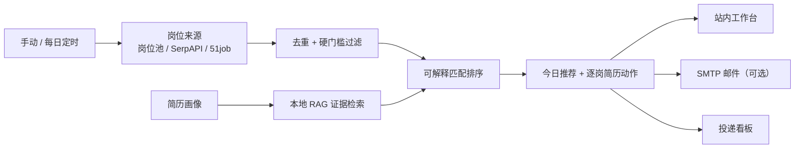
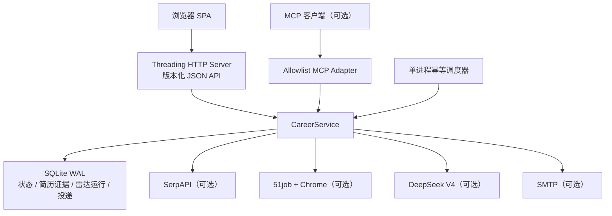

# 智职引擎技术架构

## 业务流

## 运行架构

## 关键边界

- Web 核心流程不依赖 MCP，也不依赖第三方 SDK；
- 所有外部能力延迟加载，缺失时返回可操作的错误；
- 简历证据先本地检索，再交给大模型，模型不拥有编造事实的权限；
- Web 不接受服务器本地文件路径，只接受受大小限制的文件内容；
- 默认仅本机访问；公网身份认证交由反向代理或平台网关；
- 内置调度器只适用于单进程，多副本部署必须使用外部调度与分布式锁。

## 持久化

SQLite 数据库包含：

- `resumes`：简历画像与评分；
- `resume_evidence`：可检索简历证据块；
- `app_state`：岗位池、偏好和最新摘要；
- `radar_runs`：工作流运行审计；
- `applications`：投递 CRM。

所有连接启用 WAL、`busy_timeout` 和外键约束。运行数据由 `APP_DATA_DIR` 指定，不写入安装目录。
